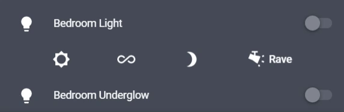
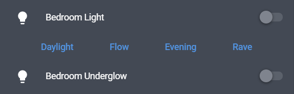
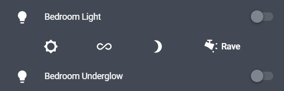
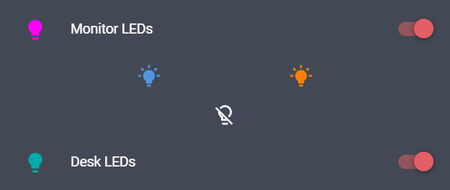

# Button Entity Row

Creates a row or rows of buttons to be placed in an `entities` card.



## Options

| Name | Type | Requirement | Description
| ---- | ---- | ------- | -----------
| type | string | **Required** | `custom:button-entity-row`
| buttons | object | **Required** | List of buttons to display.

## Button Object
| Name | Type | Requirement | Description
| ---- | ---- | ------- | -----------
| entity | string | **Optional** | The entity_id of the entity you want to show.
| name | string | **Optional** | Name to use for entity.
| icon | string | **Optional** | Material design icon to display.
| icon_color | string | **Optional** | (Depreciated in favor of `style`) options are `default`, `red`, `green`, `yellow`, `grey`.
| style | object | **Optional** | CSS styles to apply to the button.
| service | string | **Optional** | The Home Assistant service to call when the button is clicked.
| service_data | object | **Optional** | Service data to be sent with the service call.

## Usage

You can specify a specific service or an entity.

- Basic setup.


```yaml
type: entities
entities:
  - entity: light.bedroom_light
  
  - type: 'custom:button-entity-row'
    buttons:
      - scene.daylight
      - entity: script.light_colour_flow
        name: Flow
      - scene.evening
      - scene.rave
```
- Some css styling, icons and icon-name buttons.


```yaml
type: entities
entities:
  - entity: light.bedroom_light
  
  - type: 'custom:button-entity-row'
    buttons:
      - entity: scene.daylight
        icon: 'mdi:brightness-5'
        style:
          - color: white
      - entity: script.light_colour_flow
        icon: 'mdi:all-inclusive'
        style:
          - color: white
      - entity: scene.evening
        icon: 'mdi:brightness-3'
        style:
          - color: white
      - entity: scene.rave
        icon: 'mdi:track-light'
        name: Rave
        style:
          - color: white
```
- Multiple rows of buttons.


```yaml
type: entities
entities:
  - entity: light.monitor_leds
  
  - type: 'custom:button-entity-row'
    buttons:
      - - entity: scene.office_standard
          icon: 'mdi:lightbulb-on'
          style:
            - color: var(--primary-color)
        - entity: scene.office_orange
          icon: 'mdi:lightbulb-on'
          style:
            - color: 'rgb(255,126,0)'
            
      - - icon: 'mdi:lightbulb-off-outline'
          service: homeassistant.turn_off
          service_data:
            entity_id: group.office_lights
          style:
            - color: white
    
```

## Default Entities Map to Services
| Domain | Service |
| ---- | ---- |
| scene | scene.turn_on |
| light | light.toggle |
| script | script.toggle |
| switch | switch.toggle |
| media_player | media_player.media_play_pause |

## Full Configuration Example
```yaml
resources:
  - url: /local/button-entity-row.js
    type: js

views:
  - title: Home
    id: home
    cards:
      - type: entities
        title: Living Room Lights
        show_header_toggle: false
        entities:
          - type: "custom:button-entity-row"
            buttons:
            
            # full configuration example
              - icon: mdi:lightbulb-on
                icon_color: yellow
                name: "On"
                service: scene.turn_on
                service_data:
                    entity_id: scene.lights_up
                    
            # basic entity, uses hass configured icon to display
              - scene.lights_out
              
            # entity with some overrides
              - icon: mdi:movie
                name: Movie
                entity: scene.movie_lights
```

You can also specify multiple rows of buttons

```yaml
resources:
  - url: /local/button-entity-row.js
    type: js

views:
  - title: Home
    id: home
    cards:
      - type: entities
        title: Living Room Lights
        show_header_toggle: false
        entities:
          - type: "custom:button-entity-row"
            buttons:
              - - switch.light_1
                - switch.light_2
              - - media_player.roku
                - light.lamp
```
