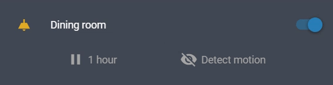

_Forked from [custom-cards/button-entity-row](https://github.com/custom-cards/button-entity-row)._

This implementation simplify the code and removes some edge cases.

# Button Entity Row

Creates a row of buttons to be placed in an `entities` card.


## Options

| Name    | Type                                   | Requirement  | Description                 |
| ------- | -------------------------------------- | ------------ | --------------------------- |
| type    | `string`                               | **Required** | `custom:button-entity-row`  |
| buttons | `string` or [`Button`](#button-object) | **Required** | List of buttons to display. |

## `Button` Object

| Name         | Type                        | Requirement  | Description                                                    |
| ------------ | --------------------------- | ------------ | -------------------------------------------------------------- |
| entity       | `string`                    | **Optional** | The entity_id of the entity you want to show.                  |
| name         | `string`                    | **Optional** | Name to use for entity.                                        |
| icon         | `string`                    | **Optional** | Material design icon to display.                               |
| state_icons  | `{[state: string]: string}` | **Optional** | Material icon for each specific state of the entity            |
| style        | `object`                    | **Optional** | CSS styles to apply to the button.                             |
| service      | `string`                    | **Optional** | The Home Assistant service to call when the button is clicked. |
| service_data | `object`                    | **Optional** | Service data to be sent with the service call.                 |

## Usage

You can specify directly an entity name or use the [`Button`](#button-object) object.

### Basic setup.


```yaml
type: entities
entities:
  - entity: light.bedroom_light

  - type: "custom:button-entity-row"
    buttons:
      - scene.daylight
      - entity: script.light_colour_flow
        name: Flow
      - scene.evening
      - scene.rave
```

---

### Using state icons.



```yaml
type: entities
entities:
  - entity: light.dining_room

  - type: "custom:button-entity-row"
    buttons:
      - entity: script.pause_kitchen_motion
        icon: "mdi:pause"
        name: 1 hour
        style:
          - color: var(--paper-item-icon-color)
      - entity: input_boolean.kitchen_motion_sensor
        name: Detect motion
        state_icons:
          "off": "mdi:eye-off"
          "on": "mdi:motion-sensor"
```

---

### Some css styling, icons and icon-name buttons.


```yaml
type: entities
entities:
  - entity: light.bedroom_light

  - type: "custom:button-entity-row"
    buttons:
      - entity: scene.daylight
        icon: "mdi:brightness-5"
        style:
          - color: white
      - entity: script.light_colour_flow
        icon: "mdi:all-inclusive"
        style:
          - color: white
      - entity: scene.evening
        icon: "mdi:brightness-3"
        style:
          - color: white
      - entity: scene.rave
        icon: "mdi:track-light"
        name: Rave
        style:
          - color: white
```

---

### Multiple rows of buttons.


```yaml
type: entities
entities:
  - entity: light.monitor_leds

  - type: "custom:button-entity-row"
    buttons:
      - entity: scene.office_standard
        icon: "mdi:lightbulb-on"
        style:
          - color: var(--primary-color)
      - entity: scene.office_orange
        icon: "mdi:lightbulb-on"
        style:
          - color: "rgb(255,126,0)"

  - type: "custom:button-entity-row"
    buttons:
      - icon: "mdi:lightbulb-off-outline"
        service: homeassistant.turn_off
        service_data:
          entity_id: group.office_lights
        style:
          - color: white
```

## Default Entities Map to Services

| Domain        | Service                       |
| ------------- | ----------------------------- |
| automation    | automation.toggle             |
| cover         | cover.toggle                  |
| fan           | fan.toggle                    |
| input_boolean | input_boolean.toggle          |
| light         | light.toggle                  |
| script        | script.toggle                 |
| switch        | switch.toggle                 |
| vacuum        | vacuum.toggle                 |
| media_player  | media_player.media_play_pause |
| scene         | scene.turn_on                 |

## Full Configuration Example

```yaml
resources:
  - url: /local/custom-lovelace/button-entity-row/button-entity-row.js?v=0.0.1
    type: js

views:
  - title: Home
    id: home
    cards:
      - type: entities
        title: Living Room Lights
        show_header_toggle: false
        entities:
          - type: "custom:button-entity-row"
            buttons:
              # full configuration example
              - icon: mdi:lightbulb-on
                icon_color: yellow
                name: "On"
                service: scene.turn_on
                service_data:
                  entity_id: scene.lights_up

              # basic entity, uses hass configured icon to display
              - scene.lights_out

              # entity with some overrides
              - icon: mdi:movie
                name: Movie
                entity: scene.movie_lights
```

You can also specify multiple rows of buttons

```yaml
resources:
  - url: /local/custom-lovelace/button-entity-row/button-entity-row.js?v=0.0.1
    type: js

views:
  - title: Home
    id: home
    cards:
      - type: entities
        title: Living Room Lights
        show_header_toggle: false
        entities:
          - type: "custom:button-entity-row"
            buttons:
              - - switch.light_1
                - switch.light_2
              - - media_player.roku
                - light.lamp
```
